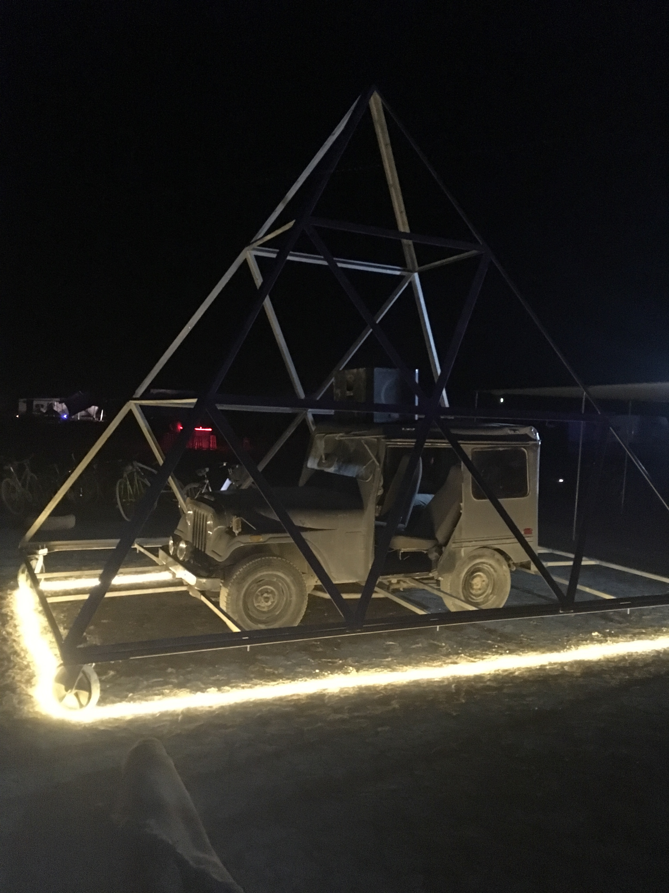
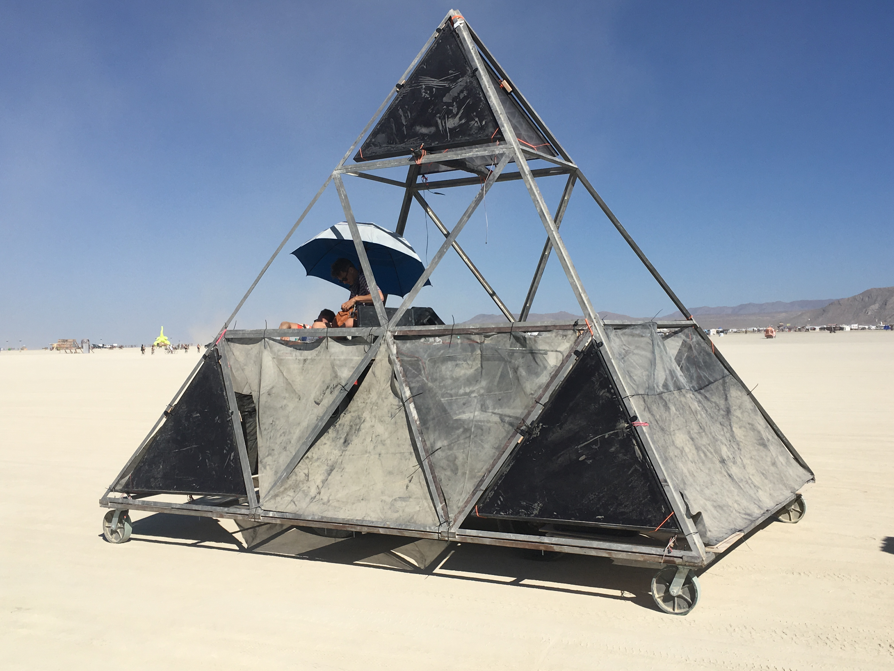
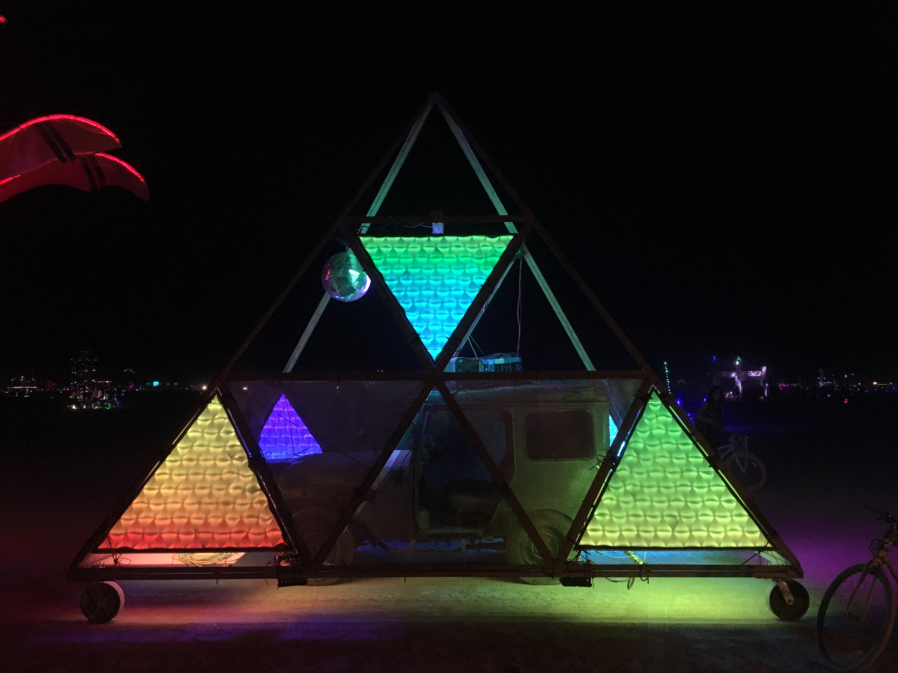
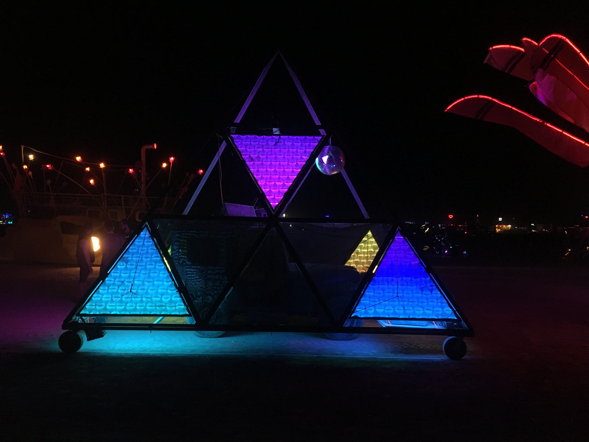
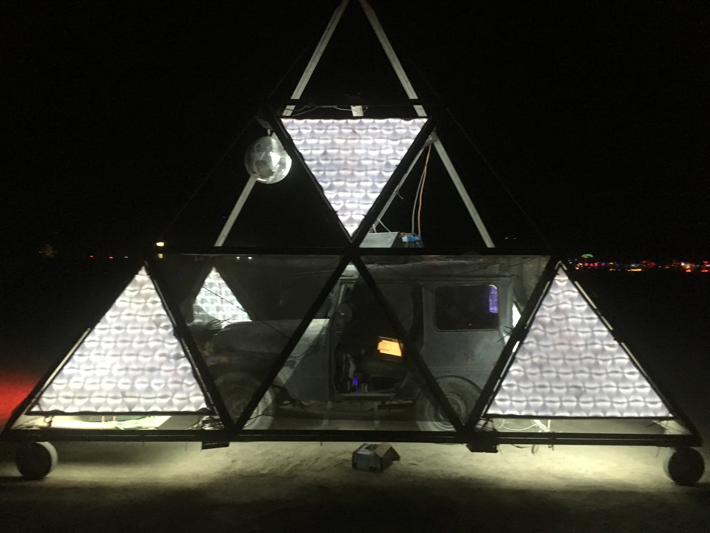

# Pyramid Scheme

Is an mutant vehicle which has attended burning man on 3 occasions so far. The project involves a number of people, mostly Oakland/SF Bay Area folks who have made it happen each year.  

> It's probably one of the more punk rock art cars on the playa :-) all steel, built on a '75 CDJ5 Postal Delivery Jeep. I could write more, but this little historical archive is for some of the footage of the lighting panel system we built for 2019, upgrading to RGBW LEDs.

> Note-  we chose to use a 1-way black translucent acrylic facing for the panels, which looked bad ass in the day, but at night when back lit was more or less opaque... but not totally, it still added a bit of a smoky hue to the lights.

# Here are some pictures of the Pyramid

### Under Construction
.

### Daytime
.

### Night Pictures of Panels On

#### All the colours

#### Moody

#### White! (no RGV shadows at the edges of the white color wash)
 * Recall, this white is going through the smoked black 1way acrylic.

## Brief Videos
The animated gifs link to proper videos, sadly we only returned with minimal footage of the panels in action, so this is all we have.

### More Traigles

### Fill-in

### Sparkles

